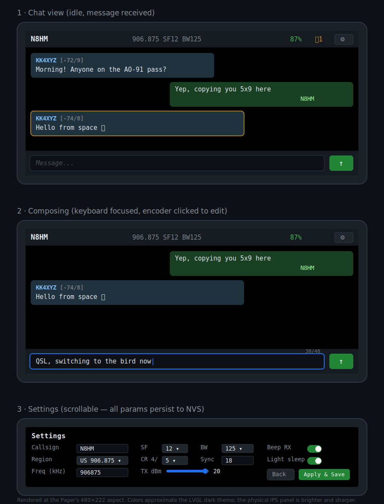

# CardSatPager

A self-contained, fully interactive **CardSat-compatible LoRa messenger** for the
**LilyGo T-LoRa Pager** (ESP32-S3 + SX1262). It interoperates with an **M5Stack
Cardputer ADV running CardSat 0.9.24** as a peer on the same unaddressed broadcast
channel, per the CardSat LoRa messaging protocol.

> ⚠️ **Amateur radio, no encryption.** This carries callsign-identified text on
> amateur bands (default 906.875 MHz / 33 cm in the US; EU 433.775, JP 431.000).
> Operate only on a band your licence permits, at a legal power level. There is no
> encryption — amateur rules generally prohibit it.
>
> ⚠️ **Bench-verify first.** CardSat's own LoRa path is marked *untested* in its
> firmware. Confirm TX/RX between the two units before relying on the link.



## Features

- **LVGL UI** driven by the QWERTY keyboard + encoder: scrolling chat (yours
  green/right, theirs left with RSSI/SNR), on-screen compose with a live 48-byte
  counter, and a status bar (callsign, radio summary, battery, unread bell badge).
- **Notifications**: screen-wake, optional beep, optional vibrate, unread badge.
- **Power management**: idle backlight dimming, an RX-preserving light-sleep nap,
  and optional deep sleep after a longer idle timeout.
- **Full on-device configuration, persisted to NVS**: callsign, region preset,
  frequency, SF, bandwidth, coding rate, sync word, TX power, brightness, dim and
  sleep timeouts, and notification/light-sleep toggles. Change any of them in
  Settings → Apply & Save and the radio reconfigures live.

The CardSat-specific logic (frame format, radio parameters) is byte- and
parameter-exact and lives in HAL-independent code that is unit-tested against the
protocol's worked example.

## Repository layout

```
CardSatPager/
├── CardSatPager.ino       Main: init, LVGL bridge, main loop, power policy
├── cardsat_proto.h        HAL-independent frame build/parse + constants
├── config.h               All params, NVS persistence, region presets, validation
├── radio.h / radio.cpp    SX1262 wrapper — every RadioLib call lives here
├── msgstore.h             24-deep message history ring (mirrors CardSat MSG_MAX)
├── notify.h               Beep/vibrate/wake on incoming
├── ui.h / ui.cpp          LVGL chat + compose + settings screens
├── sketch.yaml            arduino-cli build profile (pins core + FQBN)
├── docs/
│   ├── mockups.svg            UI mockups (shown above)
│   └── BUILD_ENVIRONMENTS.md  Keeping Pager and Cardputer toolchains separate
├── LICENSE                MIT
└── .gitignore
```

## Quick start

1. **Install the toolchain.** Arduino IDE + arduino-esp32 **≥ 3.3.0-alpha1**,
   then **LilyGoLib** (Add .ZIP Library) and the **LilyGoLib-ThirdParty** bundle
   (copy the folders *inside* it — XPowersLib, RadioLib 7.7.1, SensorLib, the
   display/LVGL drivers — into your `libraries/`). Don't let the IDE auto-update
   these.
2. **Board settings.** Board *LilyGo-T-LoRa-Pager*, Revision *Radio-SX1262*, USB
   CDC On Boot *Enabled*, Partition *16M (3M APP / 9.9MB FATFS)*, PSRAM enabled.
3. **Open `CardSatPager.ino`** (keep all files in one folder) and Upload. If
   upload fails: hold **BOOT**, tap **RST**, release BOOT, Upload.
4. **First boot:** open Settings (gear), set your callsign (defaults to NOCALL),
   confirm freq/SF/BW match the Cardputer, Apply & Save.

> Building CardSat for the Cardputer ADV too? Those libraries **conflict** with
> the Pager's — keep them in separate sketchbooks. See
> [docs/BUILD_ENVIRONMENTS.md](docs/BUILD_ENVIRONMENTS.md).

### Reproducible CLI build

```
arduino-cli compile --profile pager
arduino-cli upload  --profile pager -p <your-port>
```

## Typing on the Pager

Per LilyGo's keyboard convention: **Space + key** for numbers/symbols, **CAP +
key** for capitals, **left orange button + B** toggles the backlight. Click the
encoder to focus a text field, type, Enter to confirm.

## Two glue points to verify against your LilyGoLib version

Everything CardSat-specific is concrete and version-independent. A few calls touch
LilyGoLib's HAL, whose names drift between revisions. If compilation fails, these
are the only places to reconcile — the protocol logic is untouched:

1. **LVGL bridge** — `bridgeLvgl()` calls `beginLvglHelper(instance)`. Match it to
   your LilyGoLib's LVGL example init call.
2. **PMU / sleep + notifications** — `instance.getBatteryPercent()`,
   `instance.isCharging()`, `instance.sleep()`, and the buzzer/haptic calls in
   `notify.h`. Substitute your revision's equivalents, or leave the related
   toggles off.

The light-sleep nap uses plain ESP-IDF `esp_light_sleep_start()` and is
version-independent.

## Pure-RadioLib fallback

`cardsat_proto.h`, `config.h`, and the `radioSend`/`radioReceive` logic are
HAL-independent. Construct `SX1262 radio = new Module(NSS, DIO1, RST, BUSY)` with
the Pager's SX1262 pins and the same setters to drive the radio without LilyGoLib.

## What it deliberately omits

No addressing, ACK, retransmit, sequence numbers, threading, presence/beacon, or
listen-before-talk — none exist in the CardSat protocol. Anything like that must be
layered *inside* the 48-byte text field as a convention; the Cardputer would render
those bytes as literal text.

## License

MIT — see [LICENSE](LICENSE).

## Acknowledgements

CardSat and its LoRa messaging protocol; LILYGO's LilyGoLib; Jan Gromeš's RadioLib;
the LVGL project.
